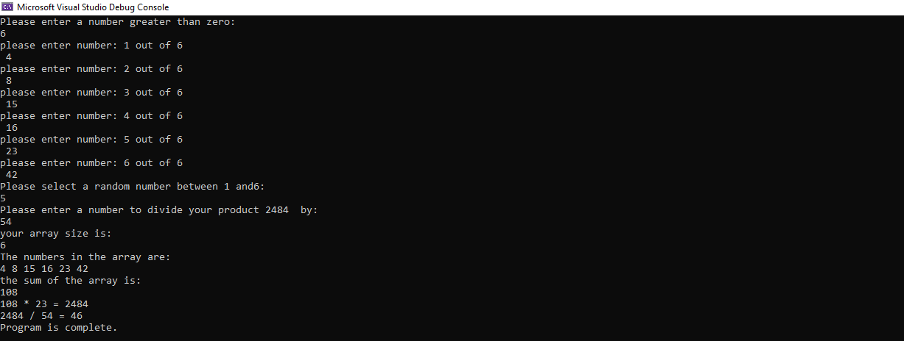

# Lab1-Numbers-Game
####  math game that takes user input, manipulates data, and utilizes error handling
#### program calculate sum, then use the sum multiplied by user input to get product, ask user to enter another number in order to divide the product by this number
* GetSum : will take array and return sum of this array, and throw exception if sum less than 20
* GetProduct: will take user input to multiplied by sum, and throw exception if user input less than 0 or greater than array length
* GetQuotient: will take user input to divided it by product, add try catch block to divide by zero exception

#### you can run program by
* Clone repo to your device.
* Open the project in Visual Studio.
* press ctl + f5  or go to Debug > Start Without Debugging to run the file and see results 

#### program contain additional custom exception code
1. user will insert a number which will implemented as array size
2. user will be asked to enter numbers until fill the array 
3. then the user will be asked to enter number, this number concidered as index for element which will be multiplied by sum
4. user will be asked to enter a number to divide product by
5. result will appear like shown in the image 